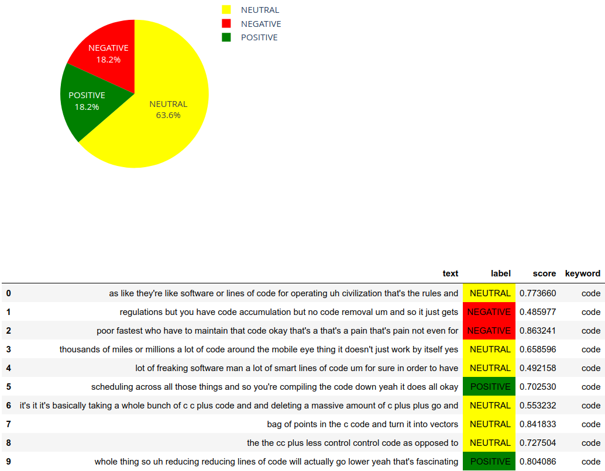

# Sentiment Visualization

## Query-Based Sentiment Visualization of Tweets Over Time
The examples use a RoBERTa-based sentiment classification model trained on twitter. Inference is done on data collected from the `tweepy` api.

## Query-Based Sentiment Visualization of Aggregated Youtube Transcripts
The examples use a RoBERTa-based sentiment classification model. Inference is done on data collected from `youtube-transcript-api`. The user provides a list of youtube URLs, and the transcripts are combined and saved. The user can then query the transcripts for keywords and view the sentiment associated with that keyword. It is also possible to specify a sliding window size to group transcript entries together, allowing for greater context during inference.

